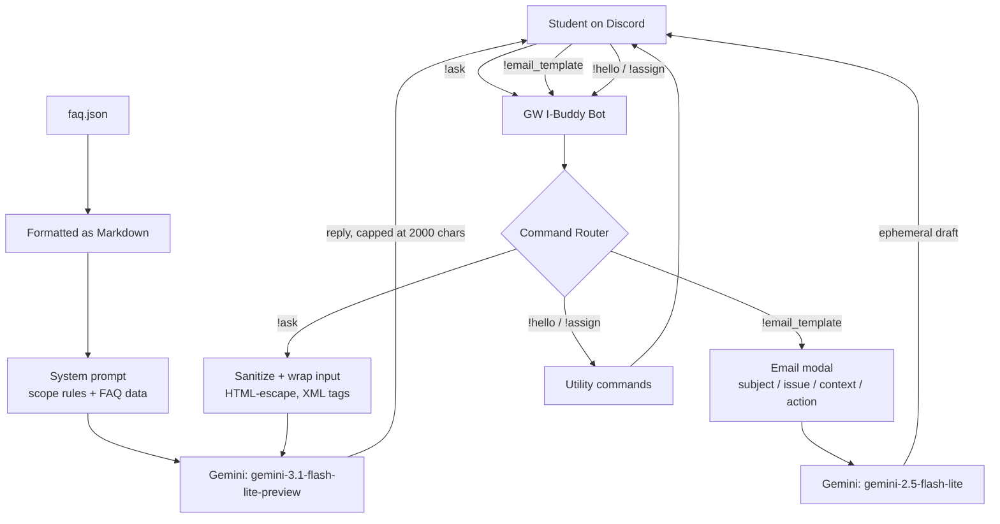

# GW I-Buddy

*AI Information Governance & Student Support Prototype*

A Discord bot that gives GW international students one reliable place to get answers, instead of digging through scattered FAQs and department pages. It answers questions from a curated knowledge base using Gemini, and generates formal email drafts for common administrative requests.

## Background

As an advisory board member at New Student Orientation, I noticed international students at the GW School of Business asking the same handful of questions every semester. Two hypotheses followed: incoming students (often visiting the U.S. for the first time) are anxious about things FAQs don't cover well — housing, making friends, coursework difficulty — and for simple questions, it's just faster to ask a person than to search documentation.

To check this, I ran a survey with the G&EE team at the GW School of Business (35 respondents). Three patterns came out of it:

- Students can find basic information but struggle with complex or cross-departmental processes.
- Information is scattered across departments, causing delays and frustration.
- Unclear or slow guidance adds stress for students already adapting to a new system.

GW I-Buddy is a first attempt at addressing that: one channel, consistent answers, honest about what it doesn't know.

## Features

- `!ask` — answers school-related questions from a curated FAQ knowledge base via Gemini, rate-limited per user
- `!email_template` — modal-based form (subject / issue / context / action) that generates a formal email draft, sent privately
- `!assign` — self-service role assignment
- Welcome DM on member join
- Basic real-time content moderation
- `!switch_ask` — toggle the AI assistant on/off without redeploying
- Separate test bot token via `--test`, so changes can be verified before going live

## System structure

**Request flow**



**Deployment**

```mermaid
flowchart LR
    Dev[Local development] -->|"git push"| Repo[GitHub repository]
    Repo -->|"GitHub Actions"| CI[CI/CD pipeline]
    CI -->|deploy| Lightsail[AWS Lightsail instance]
    Lightsail --> Systemd[systemd service]
    Systemd -->|"auto-restart on failure"| Process[Bot process - main.py]
    Process -->|logs| Diag[htop / dmesg, syslog]
    Diag -->|"found ~2GB swap from background services"| MemFix[Memory fix]
    MemFix --> Process
```



## Prompt-injection defenses

Testing surfaced the bot occasionally answering questions outside its intended scope. This was closed with a few layers of defense:

- FAQ data is converted into clearly delimited Markdown before being embedded in the system prompt
- User questions are wrapped in `<user_question>` XML tags so the model treats them as data, not instructions
- User input is HTML-escaped before it reaches the model
- The system prompt explicitly restricts the assistant to school-related topics and tells it to decline off-topic requests

## Infrastructure

- Traced recurring crashes on AWS Lightsail to kernel OOM kills, found via `htop` and `dmesg`/`syslog`
- Found ~2GB of swap consumed by unrelated background services and fixed the underlying memory issue
- Added a `systemd` service for auto-restart on failure
- Added GitHub Actions CI/CD for deployment — stable 24/7 uptime since

## Tech stack

| Layer | Tools |
|---|---|
| Bot framework | Python, discord.py |
| AI | Google Gemini API (google-genai) |
| Knowledge base | faq.json, formatted as Markdown for the system prompt |
| Config | python-dotenv, environment variables |
| Hosting | AWS Lightsail |
| Reliability | systemd (auto-restart) |
| CI/CD | GitHub Actions |

## Commands

| Command | Description |
|---|---|
| `!hello` | Greets the user |
| `!assign` | Assigns the `student` role |
| `!ask <question>` | Answers a school-related question via the FAQ knowledge base + Gemini (5s cooldown/user) |
| `!email_template` | Opens a modal and generates a formal email draft via Gemini |
| `!switch_ask` | Enables/disables the `!ask` command |

## Running it locally

Prerequisites: Python 3.10+, a Discord bot token, a Google Gemini API key.

```bash
git clone <your-repo-url>
cd gw-i-buddy
pip install discord.py python-dotenv google-genai pyyaml
```

`.env`:
```
DISCORD_TOKEN=your_discord_bot_token
TEST_DISCORD_TOKEN=your_test_bot_token   # optional, used with --test
GEMINI_API_KEY=your_gemini_api_key
```

```bash
python main.py            # production
python main.py --test     # local/test environment
```

## Roadmap

- Move the FAQ knowledge base to a retrieval-augmented (RAG) pipeline instead of embedding the full dataset in the system prompt
- Detect personal/records-related questions (grades, GPA, visa status) and redirect to the right office instead of answering directly
- Broader content moderation beyond a single keyword filter
- Usage analytics (most-asked topics, response quality, cooldown hits)
- Support threaded follow-up conversations

## Acknowledgments

Thanks to the G&EE team at the GW School of Business for supporting the validation survey, and to the 35 students who responded.
